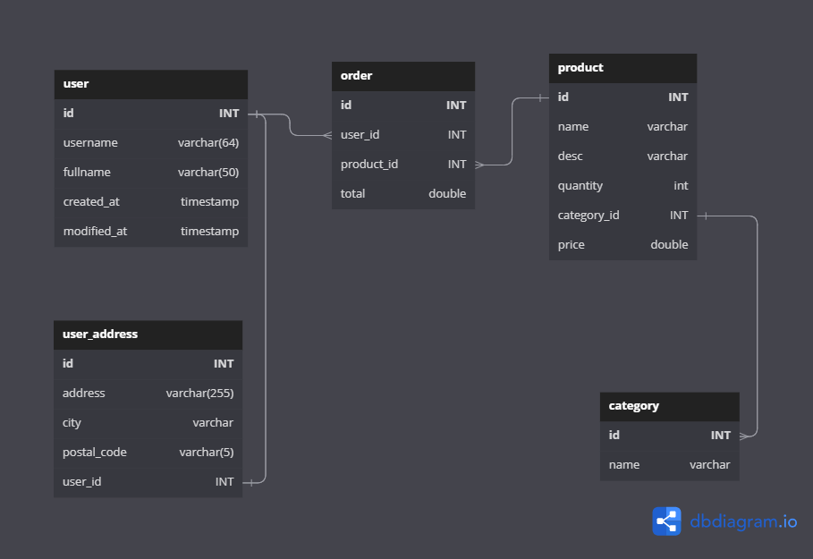

Membuat database
Membuat tabel (semua table harus dibuat)
Mengisi data ke tabel (minimal 10 data per tabel)
Mengambil data dari tabel
Mengubah data di tabel
Menghapus data di tabel
Menghapus tabel
Menghapus database

kasus
1 pelanggan membeli 3 barang yang berbeda.
Melihat 3 produk yang paling sering dibeli oleh pelanggan.
Melihat Kategori barang yang paling banyak barangnya.
Nominal rata-rata transaksi yang dilakukan oleh pelanggan dalam 1 bulan terakhir.